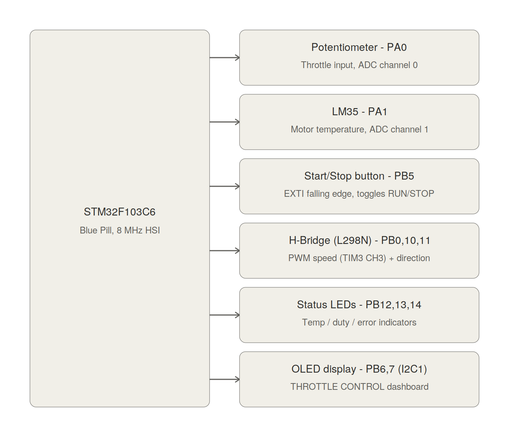
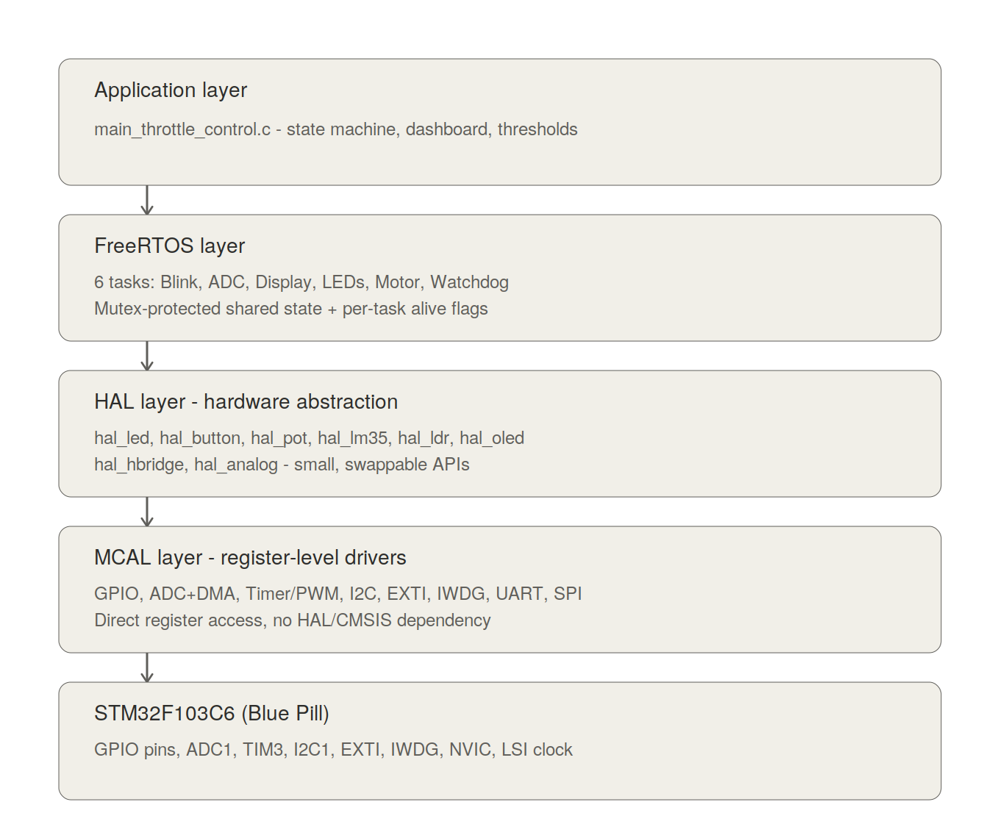
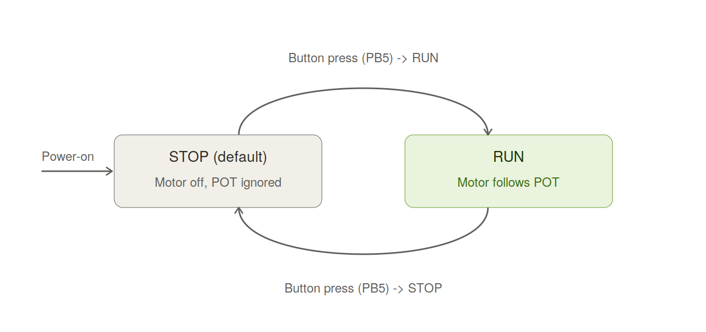
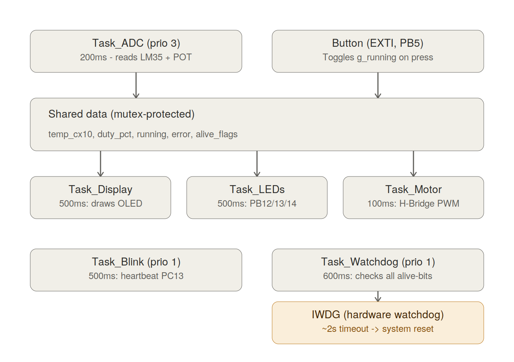

# STM32F103C6 Throttle Control — Register-Level Drivers + FreeRTOS

A complete, register-level (no HAL/CMSIS) embedded firmware project for the
STM32F103C6 (Blue Pill), implementing a **DC motor throttle controller** with
a potentiometer, temperature monitoring, an OLED dashboard, status LEDs, a
start/stop button, and a hardware watchdog — all running on **FreeRTOS**.

This project was built from the ground up to demonstrate two things:

1. **Real, register-level peripheral drivers** — every MCAL driver talks
   directly to STM32 peripheral registers (GPIO, ADC+DMA, Timer/PWM, I2C,
   EXTI, IWDG, UART, SPI). No `stm32f1xx_hal_*` files anywhere.
2. **A clean, layered architecture** that scales — the same MCAL/HAL stack
   used here has powered several other projects (SmartHome FreeRTOS system,
   CAN/LIN drivers, sensor dashboards) without modification.

---

## What it does

The system is a small **motor throttle controller**:

- A **potentiometer** sets the desired motor speed (0–100%).
- An **LM35** sensor measures the motor's temperature.
- A **push button** (EXTI interrupt) toggles the motor between **STOP** and
  **RUN**. The system always boots into **STOP** — the motor stays off and
  the potentiometer is ignored until the button is pressed.
- An **OLED display** shows a live "THROTTLE CONTROL" dashboard: motor
  state, current speed, and motor temperature.
- Three **status LEDs** reflect temperature, throttle level, and error
  state at a glance.
- An **independent hardware watchdog (IWDG)** monitors every task in the
  system. If *any single task* hangs, the whole MCU resets automatically
  within ~2 seconds — no manual reset needed.

| Pin | Function |
|---|---|
| PA0 | Potentiometer (ADC channel 0) — throttle |
| PA1 | LM35 (ADC channel 1) — motor temperature |
| PB5 | Start/Stop button (EXTI, internal pull-up) |
| PB0 | H-Bridge PWM enable (TIM3 CH3) |
| PB10 / PB11 | H-Bridge direction (IN1 / IN2) |
| PB12 / PB13 / PB14 | Status LEDs (temp / duty / error) |
| PB6 / PB7 | OLED (I2C1, SSD1306/SH1106) |

> **Note on PB3/PB4:** these are avoided for GPIO/EXTI use because they are
> shared with the JTAG debug interface on STM32F103 and are not free as
> plain GPIO without an AFIO remap.

### Pinout diagram



---

## Why this project is built the way it is

Three design goals drove every decision in this repo:

- **Clean** — every file has one job. A driver never reaches into another
  driver's internals. Shared state between FreeRTOS tasks goes through a
  single mutex-protected struct, never raw globals scattered everywhere.
- **Layered** — strict one-directional dependencies (Application → FreeRTOS
  → HAL → MCAL → Hardware). Nothing in MCAL knows that FreeRTOS exists.
  Nothing in HAL contains a single register access — it's all done through
  MCAL function calls.
- **RTOS-first** — the whole application is expressed as independent
  FreeRTOS tasks communicating through a small, well-defined shared-state
  block, instead of one big polling `while(1)` loop. This is the same
  structure used in production automotive/embedded firmware.

---

## Architecture

The firmware is organized into five layers. Each layer only depends on the
layer directly below it — the Application layer never touches a register,
and the MCAL layer has no idea FreeRTOS exists.



| Layer | Contents |
|---|---|
| **Application** | `main_throttle_control.c` — task definitions, state machine, OLED dashboard layout, thresholds |
| **FreeRTOS** | 6 tasks, 1 mutex, the "all-tasks-alive" watchdog-feeding pattern |
| **HAL** | `hal_led`, `hal_button`, `hal_pot`, `hal_lm35`, `hal_ldr`, `hal_oled`, `hal_hbridge`, `hal_analog` — small, single-purpose, swappable APIs |
| **MCAL** | `stm32f103c6_gpio/adc/dma/timer/i2c/EXTI/iwdg/uart/spi` — direct register access |
| **Hardware** | STM32F103C6 peripherals: GPIO, ADC1, TIM3, I2C1, EXTI, IWDG, NVIC, LSI clock |

**Why this matters in practice:** swapping the OLED for a different display
only touches `hal_oled`. Porting the whole project to an STM32F4 only
touches MCAL — every HAL driver, every task, and the entire application
logic stay exactly the same.

---

## Motor state machine

The motor itself is a simple two-state machine, toggled entirely by the
push button. The system **always boots into STOP** as a safety default —
the motor cannot start moving on power-up, even if the potentiometer is
turned up.



- **STOP (default):** `HBRIDGE_SetSpeedPercent(0)` every cycle. The
  potentiometer reading is still measured (for the dashboard) but is never
  applied to the motor.
- **RUN:** the motor speed is set directly from the live potentiometer
  reading, every 100 ms.

The button's EXTI interrupt handler is intentionally tiny — it does nothing
but flip one shared flag (`g_running = !g_running`). All the actual motor
logic lives in `Task_Motor`, keeping the interrupt handler fast and safe.

---

## FreeRTOS task flow

The application is split into six independent tasks, each with a single
responsibility, communicating through one mutex-protected shared-data
struct.



| Task | Priority | Period | Responsibility |
|---|---|---|---|
| `Task_ADC` | 3 | 200 ms | Reads LM35 (motor temp) and potentiometer (throttle) |
| `Task_Display` | 2 | 500 ms | Draws the "THROTTLE CONTROL" OLED dashboard |
| `Task_LEDs` | 2 | 500 ms | Drives the 3 status LEDs from shared data |
| `Task_Motor` | 2 | 100 ms | Applies throttle to the H-Bridge, only while RUNNING |
| `Task_Blink` | 1 | 500 ms | Heartbeat LED (PC13) |
| `Task_Watchdog` | 1 | 600 ms | Feeds the hardware watchdog (see below) |

The button's EXTI handler writes directly to the shared `g_running` flag
(a single byte write — safe without a mutex), independent of the periodic
tasks.

---

## The watchdog: "every task must check in"

A common failure mode in multi-task firmware is a *single* task silently
hanging — e.g. an I2C transaction that never completes — while the rest of
the system (including the heartbeat LED) keeps running, hiding the problem.

This project solves that with an **all-tasks-alive watchdog pattern**:

1. Every task sets its own bit in a shared `g_task_alive_flags` byte once
   per loop iteration.
2. `Task_Watchdog` checks every 600 ms whether **all five** bits are set.
3. If yes → it feeds the STM32's independent hardware watchdog (**IWDG**)
   and clears the flags for the next round.
4. If **any single task** fails to set its bit — for any reason — the IWDG
   is *not* fed. After its ~2 second timeout, the IWDG forces a full system
   reset, and the firmware restarts cleanly from `main()`.

This means a hang in *any one* task (not just a crash) is automatically
detected and recovered from, without any manual intervention.

```c
#define WD_ALL_TASKS (WD_BIT_BLINK | WD_BIT_ADC | WD_BIT_DISPLAY | \
                      WD_BIT_LEDS  | WD_BIT_MOTOR)

if ((g_task_alive_flags & WD_ALL_TASKS) == WD_ALL_TASKS) {
    IWDG_Refresh();
    g_task_alive_flags = 0;
}
/* else: skip the refresh — IWDG will reset the MCU after ~2s */
```

> IWDG timeout = `(4 * 2^PR) * RLR / 40000` seconds, using the STM32's
> independent ~40 kHz LSI clock. With `PR=4` and `RLR=1250`, the timeout is
> exactly 2.0 s — completely independent of the main system clock.

---

## Driver design philosophy

Every MCAL driver follows the same rules:

- **No magic numbers** — every register bit has a named `#define` with a
  comment explaining what it does.
- **Timeouts everywhere** — any `while` loop that waits on a hardware flag
  has a bounded timeout. A stuck peripheral can never hang the whole system.
- **One driver, one peripheral** — `stm32f103c6_i2c.c` knows nothing about
  the OLED; `stm32f103c6_adc.c` knows nothing about the potentiometer.

Every HAL driver follows the same rules:

- **Tiny, focused API** — `hal_lm35` exposes exactly the functions a
  temperature sensor needs (`LM35_Init`, `LM35_ReadTempCx10`,
  `LM35_ReadRaw`) and nothing else.
- **Fixed-point, not float** — e.g. LM35 temperature is returned as
  `temp x 10` (255 = 25.5°C), avoiding floating point entirely on a
  Cortex-M3 without an FPU.
- **One-line objects** — e.g. `LED_t motor = LED_Create(GPIOB, GPIO_PIN_12);`
  configures the pin *and* returns a ready-to-use handle in a single line.

---

## Repository layout

```
.
├── docs/                   - architecture diagrams (this README)
├── MCAL/                   - register-level peripheral drivers
│   ├── stm32f103_regs.h    - all peripheral register maps & bit definitions
│   ├── stm32f103c6_gpio.*
│   ├── stm32f103c6_adc.*    (+ DMA)
│   ├── stm32f103c6_timer.*  (PWM)
│   ├── stm32f103c6_i2c.*
│   ├── stm32f103c6_EXTI_DRIVER.*
│   └── stm32f103c6_iwdg.*
├── HAL/                    - hardware abstraction layer
│   ├── hal_led.*
│   ├── hal_button.*
│   ├── hal_pot.*
│   ├── hal_lm35.*
│   ├── hal_ldr.*
│   ├── hal_oled.*
│   ├── hal_hbridge.*
│   └── hal_analog.*         (shared multi-channel ADC manager)
└── FreeRTOS/
    ├── Config/FreeRTOSConfig.h
    └── main_throttle_control.c
```

---

## Building and running

- **Toolchain:** STM32CubeIDE (GCC ARM)
- **RTOS:** FreeRTOS kernel (vanilla, ported manually — no CMSIS-RTOS wrapper)
- **Target:** STM32F103C6 / STM32F103C8 "Blue Pill" board, ST-Link V2
- **Clock:** 8 MHz HSI (no PLL configuration required)

1. Import the project into STM32CubeIDE.
2. Make sure only **one** file containing `int main(void)` is included in
   the build (`main_throttle_control.c`).
3. Build and flash via ST-Link.
4. Wire up the hardware as described in the pin table above.
5. Power on → OLED shows `THROTTLE CONTROL`, state = `STOP`. Press the
   button on PB5 to start the motor.

---

## What I learned building this

This project was built through systematic, hardware-level debugging — every
fix below came from isolating a problem with the simplest possible test
(usually just an on-board LED blink pattern) before touching the code.

- **`TXE` vs `BTF` in I2C.** Waiting for `BTF` after *every* byte in a long
  I2C write (e.g. refreshing a 128-byte OLED page) is unreliable and can
  hang. The correct pattern: wait for `TXE` between bytes, and check `BTF`
  only **once**, right before issuing `STOP`.

- **Peripheral re-initialization needs a real reset.** Calling `ADC_Init()`
  a second time (to register a new channel) without first disabling `ADON`,
  performing `RSTCAL`, and stopping the DMA channel causes the calibration
  sequence to hang forever. The fix: `ADON=0 → RSTCAL → wait → ADON=1 → CAL
  → wait`, with a timeout on every wait.

- **Re-initializing one peripheral can break another.** Bringing up the ADC
  *after* I2C had already been initialized left the I2C bus stuck `BUSY`.
  The fix was a software reset (`SWRST`) inside `I2C_Init()` and a strict
  init order: **ADC/DMA first, then I2C, then OLED**.

- **Every blocking `while` on a hardware flag needs a timeout.** Without
  one, a single missing ACK or a one-cycle timing glitch can hang the
  entire firmware with no error message — exactly the class of bug the IWDG
  in this project exists to catch as a last resort.

- **PB3 and PB4 are not "free" GPIO pins on STM32F103** — they default to
  JTAG (`JTDO`/`JTRST`). A button wired to PB3 never responds, with no
  error from the toolchain, until you either remap AFIO or — much simpler —
  pick a different pin (PB5 here).

- **FreeRTOS stack sizing is not "bigger is safer."** A `Task_Display` with
  a 1024-word stack silently failed `xTaskCreate()` because it exhausted
  the entire heap, while the *same task* with a 256-word stack worked
  perfectly. Always check `xTaskCreate()`'s return value — a silent failure
  here looks identical to a hung task.

- **Multi-channel ADC + DMA needs a two-phase init.** Calling `ADC_Init()`
  once per sensor (growing the channel list each time) creates a race
  condition that scrambles the DMA result buffer order. The fix:
  `Analog_RegisterChannel()` only records channels, and a single
  `Analog_Start()` initializes the ADC once with the complete list.

- **A hardware watchdog is the right tool for "some task hung."** Software
  can't reliably detect its own deadlock. The IWDG can — and because it's
  clocked by an independent ~40 kHz oscillator, it keeps working even if
  the main clock or the RTOS itself locks up.

---

- **MCU:** STM32F103C6 (ARM Cortex-M3)
- **RTOS:** FreeRTOS (tasks, mutexes, `vTaskDelayUntil`)
- **Peripherals:** GPIO, ADC (multi-channel + DMA), TIM3 (PWM), I2C1, EXTI,
  IWDG
- **Display:** SSD1306/SH1106 0.96" OLED (I2C, custom text-mode driver with
  5x7 font)
- **Actuator:** DC motor via L298N H-Bridge
- **Language:** C, register-level, zero HAL/CMSIS dependencies
